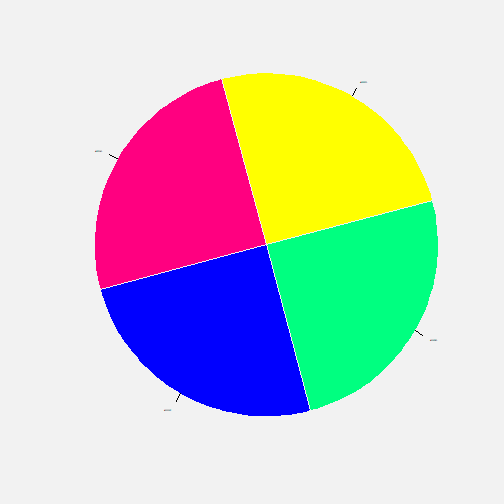
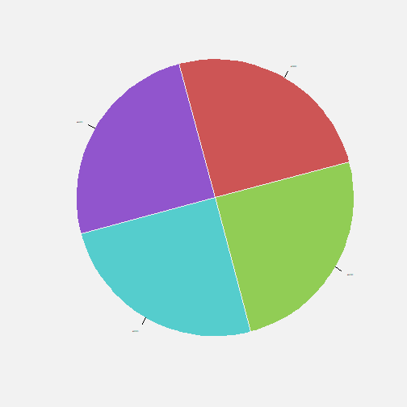
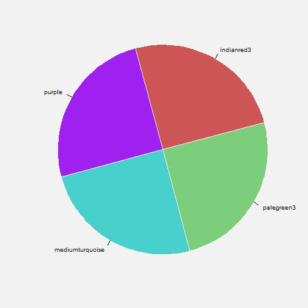
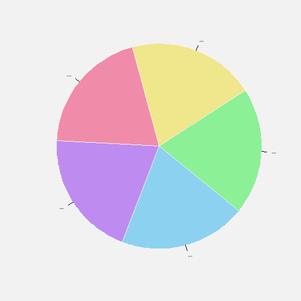
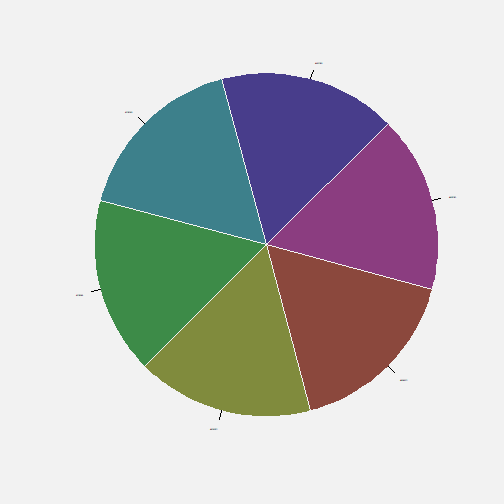
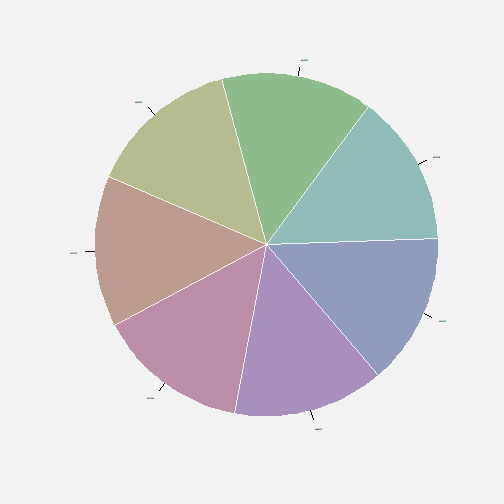

color_y_memoria.rpres
========================================================
author: Pedro.ConcejeroCerezo at telefonica.com
date: 24 octubre 2014 VI joRnadas usuaRios R 

twitter <https://twitter.com/ConcejeroPedro>

linkedin <http://www.linkedin.com/in/pedroconcejero/es>

gRupo local R madRid <http://madrid.r-es.org/> 

EJERCICIO DE COLOR Y MEMORIA
============================

Tarea: localizar en tabla (<http://research.stowers.org/mcm/efg/R/Color/Chart/ColorChart.pdf>)

*y apuntar* los colores que van a estar proyectados.

Forzosamente habrá que actuar rápido, haré desaparecer los colores entre 20 y 40 seg. después de comenzar -en función de la dificultad de la tarea.

Ejemplo (este será muy fácil, ya veréis)

Ejemplo
=======

Ejercicio 1
===========

Verificiación Ejercicio 1
===========

***
  

Ejercicio 2
===========

Ejercicio 3
===========

Ejercicio 4
===========

COLOR Y MEMORIA Y SEMÁNTICA
==============================

El manejo del color depende mucho del contexto natural y social de individuos, 

esto se refleja en los nombres de que disponemos para los colores. 

Por ejemplo, los esquimales disponen de muchos nombres diferentes para matices de blanco que una persona viviendo más al sur será absolutamente incapaz de distinguir. 

Del mismo modo, grupos de nativos de la Amazonia disponen de multitud de términos para verde, mientras que no distinguen entre otros colores básicos como azul.

NOMBRES Y COLORES: Términos de Color Básicos
==============================
son 11 (en español e inglés):

A1. Cromáticas Primarias
Rojo-Red; Verde-Green; Azul-Blue; Amarillo-Yellow

A2. Acromáticas Primarias 
Blanco-White; Negro-Black

B1. Cromáticas derivadas
Marrón-Brown; Naranja-Orange; Rosa-Pink  Morado-Purple (or Violeta-Violet)

B2. Acromáticas derivadas
Gris-Grey 

Recomendaciones
================

- *No utilizar color como única clave de categorización*

- Si no tenemos más remedio:

  - Estaremos limitados por los 7 colores básicos con nombre unívoco.
  
  - Incorporaremos *siempre* una leyenda asociando colores a significado.

  - Además colocaremos la leyenda lo más próxima posible al gráfico.

